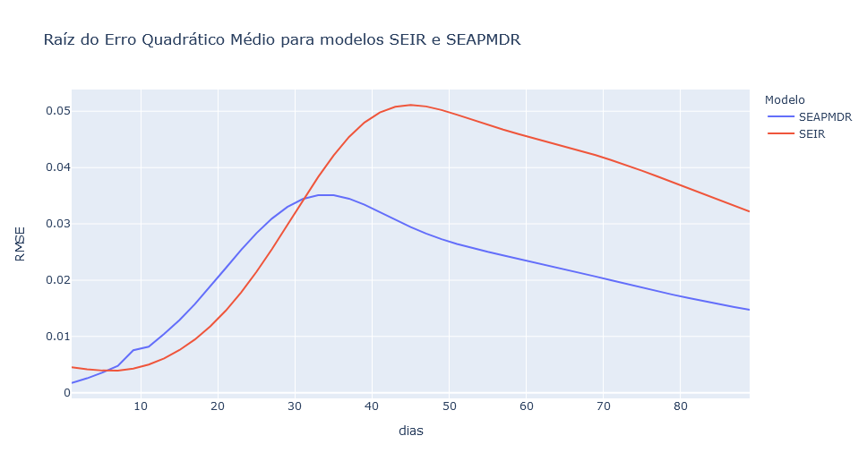

# Desafio ImpulsoGov - SimulaCovid

*Este repositório contém a descrição e a implementação de análises em resposta
ao desafio de ciência de dados da ImpulsoGov disponível
[neste outro repositório][Desafio].*

A [Impulso] é uma organização da sociedade civil que tem como missão
potencializar governos para entregar melhores serviços públicos aos cidadãos
que mais precisam. Desde março de 2019, tem trabalhado com governos municipais
e estaduais e com outras organizações da sociedade civil para o combate à
emergência sanitária gerada pela COVID-19, por meio da disponibilização de
informação qualificada, dados, ferramentas e suporte especializado.

Saiba mais em: [Coronacidades.org]

[Coronacidades.org]: https://coronacidades.org/
[Desafio]: https://github.com/ImpulsoGov/techdados_desafio_datasience
[Impulso]: https://www.impulsogov.com.br

## Início rápido

### Dependências

Este pacote utiliza o **Python versão 3.8** para rodar. Veja as instruções para
instalação [no site oficial](https://www.python.org/downloads/).

As demais dependências são instaladas diretamente a partir do arquivo
`requirements.txt` que acompanha o pacote (veja a seção
[Instalação](#instalação) a seguir).

**Importante**: este pacote é experimental e foi testado apenas em WSL2,
Ubuntu 18.04. O funcionamento em outras plataformas pode demandar configurações
adicionais.

### Instalação

Para executar a análise descrita nos passos seguintes em sua própria máquina,
você deve primeiro clonar este repositório para um diretório local:

```text
$ git clone https://github.com/bcbernardo/impulsogov-desafio-simulacovid
$ cd impulsogov-desafio-simulacovid
```

Recomendamos que você crie um ambiente virtual do Python para armazenar as
dependências necessárias - por exemplo, utilizando a ferramenta `venv`, nativa
do Python3:

```text
$ python3 -m venv .venv
$ source ./.venv/bin/activate
```

Instale as dependências usando o `pip` (ou outro gerenciador de pacotes da sua
preferência):

```text
$ python3 -m pip install -r requirements.txt
```

### Uso

O processo de instalação providenciará dependências necessárias, incluindo o
Jupyter Notebook - necessário para visualizar e rodar os notebooks interativos.

Para iniciar o Jupyter, ative o ambiente virtual a partir do terminal (`source
./.venv/bin/activate`) e, em seguida, inicie o servidor:

```text
$ jupyter notebook
```

Alguns links aparecerão no seu terminal. Copie qualquer um deles no seu
navegador para visualizar a [estrutura do
repositório](#estrutura-do-repositório). Em seguida, vá até o diretório
`notebooks/` e abra o notebook `simulation.ipynb` para iniciar uma simulação.

## Estrutura do repositório

Este repositório contém três pastas principais de interesse para a resolução
do desafio:

- Diretório [`./code`](./code): contém as funções necessárias a realizar a
simulação do modelo SEIR original (arquivo `seir.py`) e do modelo modificado
(SEAPMDR - arquivo `seapmdr.py`).
- Diretório [`./notebooks`](./notebooks): contém os *notebooks* para gerar as
  simulações e análises.
  - Arquivo [`simulation.ipynb`]: *notebook* para a geração do histórico de
  previsões dos modelos SEIR e SEAPMDR.
  - Arquivo [`analysis.ipynb`]:
- Dados: contém dados intermediários e finais da simulação e análise. Embora
esses arquivos também possam ser gerados a partir dos notebooks e do [*fork* do
repositório **coronacidades-datasource**][Coronacidades Fork], alguns deles
podem levar várias horas para serem escritos, de modo que sugerimos a
utilização da versão local.
  - Arquivo [`br-states-farolcovid-history.csv`]: contém dados tratados da
  situação epidemiológica dos estados brasileiros desde os primeiros casos.
    - Codificação: *UTF-8*.
    - Separador: **,**
  - Arquivo [`br-states-simulacovid-predictions.csv`]: (retro)previsões geradas
  a partir dos modelos SEIR e SEAPMDR para os estados brasileiros, com base
  no histórico de registros epidemiológicos.
    - Codificação: *UTF-8*.
    - Separador: **,**

[`analysis.ipynb`]: ./notebooks/analysis.ipynb
[`simulation.ipynb`]: ./notebooks/simulation.ipynb
[`br-states-farolcovid-history.csv`]: ./data/br-states-farolcovid-history.csv
[`br-states-simulacovid-predictions.csv`]: ./data/br-states-simulacovid-predictions.csv
[Coronacidades Fork]: https://github.com/bcbernardo/coronacidades-datasource

## O desafio

### Contexto

Como parte do processo de seleção da pessoa responsável pelo desenvolvimento de
análises e produtos digitais, a Impulso disponibilizou um desafio real,
relacionado à ferramenta "*SimulaCovid*".

Trata-se de um simulador de demanda hospitalar desenvolvido pela organização
para prever a quantidade adicional de leitos enfermaria e UTI necessários para
lidar com os efeitos da pandemia de SARS-CoV-2 nas unidades federativas
brasileiras.

Atualmente, a ferramenta utiliza um modelo SEIR (Suscetíveis,
Expostos, Infectados e Removidos) baseado em [Hill (2020)] para projetar o
número de casos necessitando de hospitalização e cuidados intensivos nos dias e
semanas seguintes. As entradas utilizadas nos modelos são provenientes de dados abertos, que são consolidados e distribuídos pela plataforma [FarolCovid].

[FarolCovid]: https://github.com/ImpulsoGov/farolcovid
[Hill (2020)]: https://github.com/alsnhll/SEIR_COVID19

No entanto, os desenvolvedores da ferramenta relatam que **a implementação
atual do modelo utilizado pelo SimulaCovid tem apresentado uma tendência a
subestimar o número efetivo de internações e de casos necessitando de cuidados intensivos**.

Como parte do desafio proposto pelos desenvolvedores, o trabalho contido neste repositório busca explorar hipóteses para explicar esse comportamento, bem como implementar algumas melhorias no código original, comparando a performance em
relação ao modelo original.

### Hipóteses explicativas

Como passos para compreender o funcionamento da ferramenta e identificar
possíveis pontos de melhoria, foi realizada uma revisão do código-fonte [do
SimulaCovid][SimulaCovid]; [da API][Coronacidades API] que fornece os dados por
ele utilizados e [da implementação original][Hill (2020)] em que o modelo se
baseou.

As observações, registradas em mais detalhes na [issue #9][#9], podem ser
resumidas nos seguintes pontos:

- A implementação atual aplica um período de seis dias para determinar o
  percentual da população exposta (E) a partir da estimativa de infectados
  leves (I<sub>1</sub>). Embora esse intervalo esteja de acordo com os números
  encontrados na literatura, há indícios de que esse período comporta tanto um
  período de latência (entre a exposição e o início da transmissão) quanto um
  período de incubação (em que o indivíduo exposto já pode transmitir a doença,
  mas ainda não desenvolveu sintomas) (ver [Tindale et al., 2020]; [Lee et
  al., 2020]; e [Casey et al., 2020]).
- A implementação atual utiliza dados da letalidade do SARS-CoV-2 para estimar
  as taxas de (sub)notificação e o número real de casos ativos. Embora reduza
  os vieses relacionados à contagem oficial de casos, essa abordagem também é
  sensível à subnotificações e atrasos na comunicação de óbitos relacionados à
  COVID-19.
- A implementação atual não leva em conta a possibilidade de reinfecção de
  indivíduos previamente expostos ao agente infeccioso. A extensão dessa
  hipótese ainda [está em debate][reinfecção] na literatura especializada, mas
  pode significar a necessidade de incorporar uma taxa de retorno do
  compartimento de "Recuperados" para o compartimento de "Suscetíveis" conforme
  evolui a epidemia.

Outros pontos de atenção foram encontrados por meio da [revisão de publicações acadêmicas][#1] que avaliam as limitações inerentes dos modelos do tipo SEIR e propõem melhorias ou modelos alternativos. Embora as publicações encontradas sejam sobretudo manuscritos pendentes de revisão por pares, podem orientar investigações no conjunto de dados em questão:

- A modelagem da distribuição de tempo que cada indivíduo passa em um
  compartimento de um modelo SEIR não é realista, o que leva a subestimar os
  picos de contágio e superestimar a persistência após os picos (ver [Grant,
  2020]).
- A abordagem de regularização das trajetórias da taxa de transmissão efetiva
  pode acabar determinando o resultado do modelo, e nem sempre corresponde ao
  comportamento da pandemia (ver [Parker e Pianykh, 2021]).

[#1]: https://github.com/bcbernardo/impulsogov-desafio-simulacovid/issues/1
[#9]: https://github.com/bcbernardo/impulsogov-desafio-simulacovid/issues/9
[Casey et al., 2020]: https://doi.org/10.1101/2020.05.08.20094870
[Coronacidades API]: https://github.com/ImpulsoGov/coronacidades-datasource
[Grant, 2020]: https://doi.org/10.1101/2020.10.11.20210831
[Lee et al., 2020]: https://doi.org/10.1007/s12630-020-01729-x
[Parker e Pianykh, 2021]: https://doi.org/10.1093/aje/kwab001
[reinfecção]: https://search.bvsalud.org/global-literature-on-novel-coronavirus-2019-ncov/?output=site&lang=en&from=0&sort=&format=summary&count=20&fb=&page=1&skfp=&index=tw&q=reinfection&search_form_submit=
[SimulaCovid]: https://github.com/ImpulsoGov/techdados_desafio_datasience/tree/main/code
[Tindale et al., 2020]: https://doi.org/10.7554/eLife.57149

### Implementação

#### Obtenção do histórico epidemiológico

Tanto a ferramenta SimulaCovid quanto o FarolCovid e o CoronaCidades, nos quais
ela se baseia, estão voltados principalmente para previsão em tempo real da
situação epidemiológica nos municípios, regiões de saúde e estados brasileiros.

Não é oferecida, no entanto, uma forma direta de obter as previsões antigas
realizadas pela ferramenta. Com isso, torna-se difícil avaliar o poder
preditivo do modelo existente, bem como comparar o seu desempenho com qualquer
modelo alternativo.

Ainda assim, a ferramenta CoronaCidades [disponibiliza
publicamente][Coronacidades API] o código-fonte da sua interface de programação
(API), permitindo que qualquer interessado faça modificações para outros usos
ainda não contemplados.

Aproveitando essa possibilidade, foi criado um [*fork* do repositório][Coronacidades Fork] no GitHub. Nele, implementou-se uma nova extremidade da API
(`/br/states/farolcovid/history`) que fornece justamente o histórico da
situação epidemiológica nos estados, no formato consumido pelo SimulaCovid.

O código-fonte dessa extremidade pode ser consultado [aqui][Endpoint histórico]

[Endpoint histórico]: https://github.com/bcbernardo/coronacidades-datasource/blob/master/src/loader/endpoints/get_states_farolcovid_history.py

#### Modelo SEAPDMR

Como forma de incorporar a existência de casos e de transmissão assintomática e
pré-sintomáticos da Covid-19, foram realizadas algumas alterações no modelo
utilizado originalmente para prever a evolução da epidemia nos estados.

Assim como o modelo original, as alterações se basearam na implementação
proposta por [Hill (2020)], atualizada a partir de março de 2020 para
incorporar os compartimentos de infectados assintomáticos ($I_0$) e de
indivíduos pré-sintomáticos transmissíveis ($E_1$; em oposição aos expostos
não-transmissíveis/latentes, $E_0$).

Chamamos esse modelo - fortemente baseado no original, mas com a adição de
alguns compartimentos a mais - de SEAPMDR: Suscetíveis (S), Expostos (E),
Assintomáticos (A), Pré-sintomáticos(P), Moderados (M), Doentes graves (D) e
Recuperados (R). Esse modelo se baseia em propostas como a de [Yang, Lombardi
Jr. e Yang (2020a)], que apontam que essa versão tende a capturar melhor a taxa
de transmissão no início de surtos locais [(idem, 2020b)][Yang, Lombardi Jr. e
Yang (2020b)].

Outra mudança em relação ao modelo original é a utilização da estimativa da
taxa de transmissão local para calcular o número de novos indivíduos expostos à
doença em cada unidade de tempo. Anteriormente, esse cálculo utilizava um
número único, ignorando particularidades da epidemia em cada local.

Alguns detalhes adicionais sobre as alterações estão disponíveis no [notebook
da simulação][`simulation.ipynb`]. As equações atualizadas do modelo são as
seguintes:


[Yang, Lombardi Jr. e Yang (2020a)]: https://arxiv.org/abs/2004.05715
[Yang, Lombardi Jr. e Yang (2020b)]: https://doi.org/10.1101/2020.10.11.20210831

### Análise comparativa

Foi realizada uma análise comparativa de ambos os modelos, considerando o quão
próximas as suas previsões estiveram da realidade dos registros já observados.

Para isso, utilizou-se a [raíz do erro quadrático médio
(RMSE)](https://en.wikipedia.org/wiki/Root-mean-square_deviation), que expressa
os resíduos não explicados pelo modelo, na mesma escala original (número de
infectados per capita) - ou seja, quanto menor, melhor.



O procedimento completo para a comparação dos modelos encontra-se no notebook
[`analysis.ipynb`]. Acima, reproduz-se uma visualização dos resultados,
comparando as previsões de melhor cenário em até 21 dias para ambos os modelos.

Conforme se pode pode observar na figura, ambos os modelos tem resultados
bastante parecidos nos primeiros dias. Porém, o modelo original (SEIR) tende a
manter resíduos significativamente menores do que o modelo modificado (SEAPMDR)
a partir do 18º dia, quando o resíduo desse segundo modelo aumenta em mais de
uma ordem de grandeza.

### Conclusão

Ao contrário da hipótese proposta, o modelo SEAPMDR não apresenta desempenho
superior ao modelo com menor número de compartimentos. Ao contrário, sobretudo
a partir do 18º dia de previsão, ele demonstra resíduos maiores em várias
ordens de grandeza do que o modelo SEIR, mais simples.

## Licença

Copyright 2021 Impulso, Bernardo Chrispim Baron

Este repositório utiliza o código fonte disponibilizado pela ImpulsoGov
no repositório [techdados_desafio_datascience].

O uso deste código fonte é regida por uma licença do tipo MIT, que pode ser
encontrada no arquivo [LICENSE](./LICENSE) ou em
<https://opensource.org/licenses/MIT>.

[techdados_desafio_datascience]: https://github.com/ImpulsoGov/techdados_desafio_datasience
