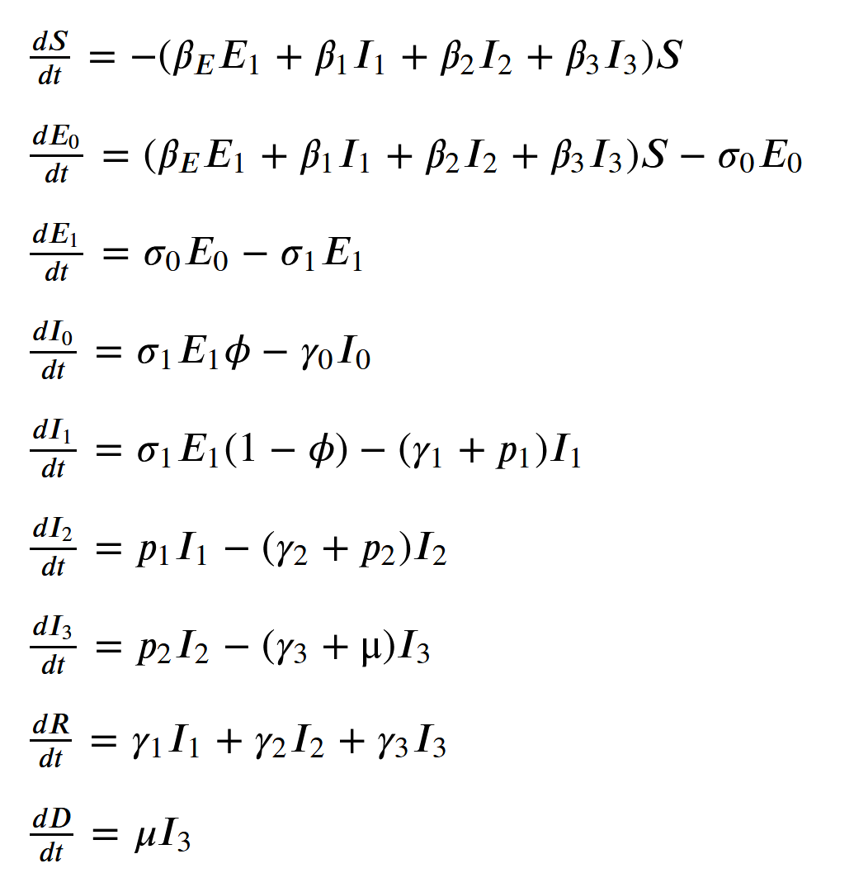
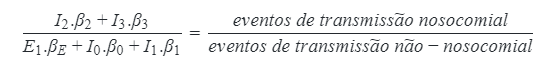
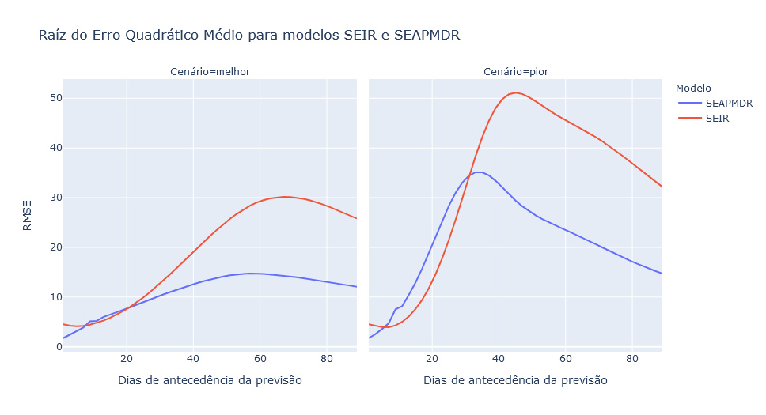

# Desafio ImpulsoGov - SimulaCovid

*Este repositório contém a descrição e a implementação de análises em resposta
ao desafio de ciência de dados da ImpulsoGov disponível
[neste outro repositório][Desafio].*

A [Impulso] é uma organização da sociedade civil que tem como missão
potencializar governos para entregar melhores serviços públicos aos cidadãos
que mais precisam. Desde março de 2019, tem trabalhado com governos municipais
e estaduais e com outras organizações da sociedade civil para o combate à
emergência sanitária gerada pela COVID-19, por meio da disponibilização de
informação qualificada, dados, ferramentas e suporte especializado.

Saiba mais em: [Coronacidades.org]

[Coronacidades.org]: https://coronacidades.org/
[Desafio]: https://github.com/ImpulsoGov/techdados_desafio_datasience
[Impulso]: https://www.impulsogov.com.br

## Início rápido

### Dependências

Este pacote utiliza o **Python versão 3.8** para rodar. Veja as instruções para
instalação [no site oficial](https://www.python.org/downloads/).

As demais dependências são instaladas diretamente a partir do arquivo
`requirements.txt` que acompanha o pacote (veja a seção
[Instalação](#instalação) a seguir).

**Importante**: este pacote é experimental e foi testado apenas em WSL2,
Ubuntu 18.04. O funcionamento em outras plataformas pode demandar configurações
adicionais.

### Instalação

Para executar a análise descrita nos passos seguintes em sua própria máquina,
você deve primeiro clonar este repositório para um diretório local:

```text
$ git clone https://github.com/bcbernardo/impulsogov-desafio-simulacovid
$ cd impulsogov-desafio-simulacovid
```

Recomendamos que você crie um ambiente virtual do Python para armazenar as
dependências necessárias - por exemplo, utilizando a ferramenta `venv`, nativa
do Python3:

```text
$ python3 -m venv .venv
$ source ./.venv/bin/activate
```

Instale as dependências usando o `pip` (ou outro gerenciador de pacotes da sua
preferência):

```text
$ python3 -m pip install -r requirements.txt
```

### Uso

O processo de instalação providenciará dependências necessárias, incluindo o
Jupyter Notebook - necessário para visualizar e rodar os notebooks interativos.

Para iniciar o Jupyter, ative o ambiente virtual a partir do terminal (`source
./.venv/bin/activate`) e, em seguida, inicie o servidor:

```text
$ jupyter notebook
```

Alguns links aparecerão no seu terminal. Copie qualquer um deles no seu
navegador para visualizar a [estrutura do
repositório](#estrutura-do-repositório). Em seguida, vá até o diretório
`notebooks/` e abra o notebook `simulation.ipynb` para iniciar uma simulação.

## Estrutura do repositório

Este repositório contém três pastas principais de interesse para a resolução
do desafio:

- Diretório [`./code`](./code): contém as funções necessárias a realizar a
simulação do modelo SEIR original (arquivo `seir.py`) e do modelo modificado
(SEAPMDR - arquivo `seapmdr.py`).
- Diretório [`./notebooks`](./notebooks): contém os *notebooks* para gerar as
  simulações e análises.
  - Arquivo [`nosocomial_cases.ipynb`]: *notebook* para extração e cálculo dos
    casos de transmissão hospitalar da COVID-19.
  - Arquivo [`simulation.ipynb`]: *notebook* para a geração do histórico de
  previsões dos modelos SEIR e SEAPMDR.
  - Arquivo [`analysis.ipynb`]: *notebook* com a análise comparativa do
    desempenho dos modelos.
- Dados: contém dados intermediários e finais da simulação e análise. Embora
esses arquivos também possam ser gerados a partir dos notebooks e do [*fork* do
repositório **coronacidades-datasource**][Coronacidades Fork], alguns deles
podem levar várias horas para serem escritos, de modo que sugerimos a
utilização da versão local.
  - Arquivo [`br-states-farolcovid-history.csv`]: contém dados tratados da
  situação epidemiológica dos estados brasileiros desde os primeiros casos.
    - Codificação: *UTF-8*.
    - Separador: **,**
  - Arquivo [`br-states-simulacovid-predictions.csv`]: (retro)previsões geradas
  a partir dos modelos SEIR e SEAPMDR para os estados brasileiros, com base
  no histórico de registros epidemiológicos.
    - Codificação: *UTF-8*.
    - Separador: **,**

[`nosocomial_cases.ipynb`]: ./notebooks/nosocomial_cases.ipynb
[`analysis.ipynb`]: ./notebooks/analysis.ipynb
[`simulation.ipynb`]: ./notebooks/simulation.ipynb
[`br-states-farolcovid-history.csv`]: ./data/br-states-farolcovid-history.csv
[`br-states-simulacovid-predictions.csv`]: ./data/br-states-simulacovid-predictions.csv
[Coronacidades Fork]: https://github.com/bcbernardo/coronacidades-datasource

## O desafio

### Contexto

Como parte do processo de seleção da pessoa responsável pelo desenvolvimento de
análises e produtos digitais, a Impulso disponibilizou um desafio real,
relacionado à ferramenta "*SimulaCovid*".

Trata-se de um simulador de demanda hospitalar desenvolvido pela organização
para prever a quantidade adicional de leitos enfermaria e UTI necessários para
lidar com os efeitos da pandemia de SARS-CoV-2 nas unidades federativas
brasileiras.

Atualmente, a ferramenta utiliza um modelo SEIR (Suscetíveis,
Expostos, Infectados e Removidos) baseado em [Hill (2020)] para projetar o
número de casos necessitando de hospitalização e cuidados intensivos nos dias e
semanas seguintes. As entradas utilizadas nos modelos são provenientes de dados abertos, que são consolidados e distribuídos pela plataforma [FarolCovid].

[FarolCovid]: https://github.com/ImpulsoGov/farolcovid
[Hill (2020)]: https://github.com/alsnhll/SEIR_COVID19

No entanto, os desenvolvedores da ferramenta relatam que **a implementação
atual do modelo utilizado pelo SimulaCovid tem apresentado uma tendência a
subestimar o número efetivo de internações e de casos necessitando de cuidados intensivos**.

Como parte do desafio proposto pelos desenvolvedores, o trabalho contido neste repositório busca explorar hipóteses para explicar esse comportamento, bem como implementar algumas melhorias no código original, comparando a performance em
relação ao modelo original.

### Hipóteses explicativas

Como passos para compreender o funcionamento da ferramenta e identificar
possíveis pontos de melhoria, foi realizada uma revisão do código-fonte [do
SimulaCovid][SimulaCovid]; [da API][Coronacidades API] que fornece os dados por
ele utilizados e [da implementação original][Hill (2020)] em que o modelo se
baseou.

As observações, registradas em mais detalhes na [issue #9][#9], podem ser
resumidas nos seguintes pontos:

- A implementação atual aplica um período de seis dias para determinar o
  percentual da população exposta (E) a partir da estimativa de infectados
  leves (I<sub>1</sub>). Embora esse intervalo esteja de acordo com os números
  encontrados na literatura, há indícios de que esse período comporta tanto um
  período de latência (entre a exposição e o início da transmissão) quanto um
  período de incubação (em que o indivíduo exposto já pode transmitir a doença,
  mas ainda não desenvolveu sintomas) (ver [Tindale et al., 2020]; [Lee et
  al., 2020]; e [Casey et al., 2020]).
- A implementação atual utiliza dados da letalidade do SARS-CoV-2 para estimar
  as taxas de (sub)notificação e o número real de casos ativos. Embora reduza
  os vieses relacionados à contagem oficial de casos, essa abordagem também é
  sensível à subnotificações e atrasos na comunicação de óbitos relacionados à
  COVID-19.
- A implementação atual não leva em conta a possibilidade de reinfecção de
  indivíduos previamente expostos ao agente infeccioso. A extensão dessa
  hipótese ainda [está em debate][reinfecção] na literatura especializada, mas
  pode significar a necessidade de incorporar uma taxa de retorno do
  compartimento de "Recuperados" para o compartimento de "Suscetíveis" conforme
  evolui a epidemia.

Outros pontos de atenção foram encontrados por meio da [revisão de publicações acadêmicas][#1] que avaliam as limitações inerentes dos modelos do tipo SEIR e propõem melhorias ou modelos alternativos. Embora as publicações encontradas sejam sobretudo manuscritos pendentes de revisão por pares, podem orientar investigações no conjunto de dados em questão:

- A modelagem da distribuição de tempo que cada indivíduo passa em um
  compartimento de um modelo SEIR não é realista, o que leva a subestimar os
  picos de contágio e superestimar a persistência após os picos (ver [Grant,
  2020]).
- A abordagem de regularização das trajetórias da taxa de transmissão efetiva
  pode acabar determinando o resultado do modelo, e nem sempre corresponde ao
  comportamento da pandemia (ver [Parker e Pianykh, 2021]).

[#1]: https://github.com/bcbernardo/impulsogov-desafio-simulacovid/issues/1
[#9]: https://github.com/bcbernardo/impulsogov-desafio-simulacovid/issues/9
[Casey et al., 2020]: https://doi.org/10.1101/2020.05.08.20094870
[Coronacidades API]: https://github.com/ImpulsoGov/coronacidades-datasource
[Grant, 2020]: https://doi.org/10.1101/2020.10.11.20210831
[Lee et al., 2020]: https://doi.org/10.1007/s12630-020-01729-x
[Parker e Pianykh, 2021]: https://doi.org/10.1093/aje/kwab001
[reinfecção]: https://search.bvsalud.org/global-literature-on-novel-coronavirus-2019-ncov/?output=site&lang=en&from=0&sort=&format=summary&count=20&fb=&page=1&skfp=&index=tw&q=reinfection&search_form_submit=
[SimulaCovid]: https://github.com/ImpulsoGov/techdados_desafio_datasience/tree/main/code
[Tindale et al., 2020]: https://doi.org/10.7554/eLife.57149

### Implementação

#### Obtenção do histórico epidemiológico

Tanto a ferramenta SimulaCovid quanto o FarolCovid e o CoronaCidades, nos quais
ela se baseia, estão voltados principalmente para previsão em tempo real da
situação epidemiológica nos municípios, regiões de saúde e estados brasileiros.

Não é oferecida, no entanto, uma forma direta de obter as previsões antigas
realizadas pela ferramenta. Com isso, torna-se difícil avaliar o poder
preditivo do modelo existente, bem como comparar o seu desempenho com qualquer
modelo alternativo.

Ainda assim, a ferramenta CoronaCidades [disponibiliza
publicamente][Coronacidades API] o código-fonte da sua interface de programação
(API), permitindo que qualquer interessado faça modificações para outros usos
ainda não contemplados.

Aproveitando essa possibilidade, foi criado um [*fork* do repositório][Coronacidades Fork] no GitHub. Nele, implementou-se uma nova extremidade da API
(`/br/states/farolcovid/history`) que fornece justamente o histórico da
situação epidemiológica nos estados, no formato consumido pelo SimulaCovid.

O código-fonte dessa extremidade pode ser consultado [aqui][Endpoint histórico]

[Endpoint histórico]: https://github.com/bcbernardo/coronacidades-datasource/blob/master/src/loader/endpoints/get_states_farolcovid_history.py

#### Modelo SEAPDMR

Como forma de incorporar a existência de casos e de transmissão assintomática e
pré-sintomáticos da Covid-19, foram realizadas algumas alterações no modelo
utilizado originalmente para prever a evolução da epidemia nos estados.

Assim como o modelo original, as alterações se basearam na implementação
proposta por [Hill (2020)], atualizada a partir de março de 2020 para
incorporar os compartimentos de infectados assintomáticos ($I_0$) e de
indivíduos pré-sintomáticos transmissíveis ($E_1$; em oposição aos expostos
não-transmissíveis/latentes, $E_0$).

Chamamos esse modelo - fortemente baseado no original, mas com a adição de
alguns compartimentos a mais - de SEAPMDR: Suscetíveis (S), Expostos (E),
Assintomáticos (A), Pré-sintomáticos(P), Moderados (M), Doentes graves (D) e
Recuperados (R). Esse modelo se baseia em propostas como a de [Yang, Lombardi
Jr. e Yang (2020a)], que apontam que essa versão tende a capturar melhor a taxa
de transmissão no início de surtos locais [(idem, 2020b)][Yang, Lombardi Jr. e
Yang (2020b)].

Outra mudança em relação ao modelo original é a utilização da estimativa da
taxa de transmissão local para calcular o número de novos indivíduos expostos à
doença em cada unidade de tempo. Anteriormente, esse cálculo utilizava um
número único, ignorando particularidades da epidemia em cada local.

Alguns detalhes adicionais sobre as alterações estão disponíveis no [notebook
da simulação][`simulation.ipynb`]. As equações atualizadas do modelo são as
seguintes:



#### Novo na v0.2.0: recálculo dos *betas* e transmissão hospitalar

A partir da versão v0.2.0, as equações para estimar as taxas de transmissão
(*betas*) de cada compartimento do modelo SEAPMDR foram recalculadas, com
premissas mais adequadas a existência dos compartimentos *assintomáticos* e
*pré-sintomáticos*.

Das notas que acompanham a atualização realizada por [Hill (2020)], foram
seguidas as suposições de que os indivíduos nos compartimentos E<sub>1</sub>,
I<sub>0</sub> e I<sub>1</sub> apresentam taxas idênticas de transmissão
(**β<sub>E</sub>=β<sub>0</sub>=β<sub>1</sub>**). Também se manteve a suposição da
implementação original de que a taxa de transmissão é idêntica entre os
compartimentos I<sub>2</sub> e I<sub>3</sub> (**β<sub>2</sub>=β<sub>3</sub>**)).

Por outro lado, não se encontrou uma implementação detalhada que calculasse as
taxas de transmissão de forma dinâmica de acordo com o decorrer da epidemia; e
que, ao mesmo tempo, incluísse compartimentos assintomáticos, pré-sintomáticos
e sintomáticos em diferentes níveis de gravidade. Desse modo, o cálculo das
taxas de transmissão partiu das suposições acima e da relação entre as taxas de
transmissão por unidade de tempo, a taxa de reprodução efetiva local
(**R<sub>t</sub>**) e o tempo médio em que um indivíduo permanece transmissível
(**t<sub>avg</sub>**):

<!-- $$
E_1 . \beta_E + I_0 . \beta_0 + I_1 . \beta_1 + I_2 . \beta_2 + I_3 . \beta_3 =
\frac{(E_1+I_0+I_1+I_2+I_3).R_t}{t_{avg}}
$$ -->


onde **t<sub>avg</sub>** pode ser calculado como média dos tempos que os indivíduos
com diferentes progressões da doença passam em cada compartimento, ponderada
pela proporção com que essas progressões aparecem no total de infectados (I):

<!-- $$
t_{avg} = \frac{I_0.(t_{E_1} + t_{I_0}) + I_1.(t_{E_1} + t_{I_1}) + I_2.(t_{E_1} + t_{I_1} + t_{I_2}) + I_3.(t_{E_1} + t_{I_1} + t_{I_2} + t_{I_3})}{I}
$$ -->


Para calcular as taxas de transmissão, foram calculadas as taxas de transmissão
hospitalar (nosocomial), a partir de dados da vigilância epidemiológica da
Síndrome Respiratória Aguda Grave do Ministério da Saúde (mais detalhes no
[respectivo notebook][`nosocomial_cases.ipynb`]). O contato com indivíduos nos
compartimentos I<sub>2</sub> e I<sub>3</sub> foi considerado como o único
responsável por esse tipo de transmissão, ao passo que assumiu-se que
indivíduos nesses compartimentos não participam da transmissão não-nosocomial.

Com isso, torna-se possível calcular a relação entre os *betas* dos
compartimentos hospitalizados e não-hospitalizados, tal que, em um intervalo de
tempo qualquer:

<!-- $$
\frac{I_2.\beta_2 + I_3.\beta_3}{E_1.\beta_E + I_0.\beta_0 + I_1.\beta_1}=\frac{eventos\ de\ transmissão\ nosocomial}{eventos\ de\ transmissão\ não-nosocomial}
$$ -->



A nova implementação calcula os *betas* a partir de um sistema de equações que considera as suposições mencionadas acima e os valores verificados ou estimados para:

- o **R<sub>t</sub>** (fornecido pelo FarolCovid);
- o **t<sub>avg</sub>** (calculado a partir dos tempos de permanência típicos
  em cada compartimento e da proporção entre indivíduos nos compartimentos
  transmissíveis);
- a proporção de casos nosocomiais (estimado a partir da vigilância da SRAG); e
- o número de pessoas em cada compartimento (estimado pelo modelo a partir de
  dados do FarolCovid).

[Yang, Lombardi Jr. e Yang (2020a)]: https://arxiv.org/abs/2004.05715
[Yang, Lombardi Jr. e Yang (2020b)]: https://doi.org/10.1101/2020.10.11.20210831

### Análise comparativa

Foi realizada uma análise comparativa de ambos os modelos, considerando o quão
próximas as suas previsões estiveram da realidade dos registros já observados.
Foram utilizadas três estratégias de visualização e análise: comparação da
curva de contágios em simulações específicas; análise dos resíduos per capita;
e análise da raíz do erro quadrático médio.

O procedimento completo para a comparação dos modelos encontra-se no notebook
[`analysis.ipynb`]. Os principais resultados são apresentados a seguir.

#### Comparação das curvas de contágio a partir de simulações

Como primeira estratégia de comparação, verificou-se como a curva de casos real
se comporta em relação às curvas de casos previstas pelos modelos SEIR e
SEAPMDR em um dado território.

Os gráficos a seguir demonstram o resultados das previsões para o Espírito
Santo em três datas - 01/05/2020, 01/08/2020 e 01/11/2020 -. No notebook
[`analysis.ipynb`] é possível realizar a mesma análise para qualquer período
com dados disponíveis e para qualquer Unidade Federativa, bem como para o
conjunto do território nacional.

**ATENÇÃO:** os gráficos a seguir possuem escalas diferentes entre si.


Essa análise permite visualizar como cada um dos modelos performam com a
simulação sendo iniciada em diferentes momentos do curso da epidemia. Em geral,
por exemplo, ambos os modelos superestimam fortemente o pico inicial de
contágios. Nesse quesito, o modelo SEAPMDR supera o modelo SEIR, prevendo uma
curva inicial de casos menos aguda - mas ainda significativamente superior à
que foi efetivamente observada.

Na fase de agosto a outubro, em que ocorre uma queda de casos, ambos os modelos acompanham a tendência geral da curva de casos ativos. O modelo SEAPMDR, porém, tende a subestimar o número de casos, enquanto o modelo SEIR tende a superestimá-lo.

Finalmente, na fase de novembro a dezembro, há um repique de casos que não é
acompanhado por nenhum dos modelos, que, na simulação realizada em 01/11/2020,
tendiam a prever queda ou estabilidade de casos, mesmo no pior cenário.

#### Análise dos resíduos per capita

Como forma de analisar o comportamento padrão de cada um dos modelos, para além do momento da epidemia em que foram aplicados, buscou-se visualizar a distribuição dos resíduos - isto é, a diferença entre o número de casos ativos previstos pelos modelos, em relação ao número efetivamente observado.

Essa análise de resíduos foi consolidada no gráfico *boxplot* reproduzido
abaixo, em que o eixo vertical é a diferença entre o previsto e o observado (em
número de casos por mil habitantes); e o eixo horizontal é o número de dias de
antecedência com que a simulação foi executada. A divisão do resíduo pelo
número de habitantes foi realizada para permitir comparar, em uma mesma
distribuição, observações em diferentes Unidades Federativas.


Conforme o esperado, a dispersão dos resíduos é maior quanto maior é o
intervalo entre a simulação e a data cujo número de casos se tenta prever -
indicando que os modelos tendem a cometer mais erros extremos, para mais e para
menos, quando são utilizados para prever a situação epidemiológica daqui a
vários meses. No entanto, essa tendência é significativamente maior no modelo
SEIR do que no SEAPMDR, indicando que o modelo SEAPMDR pode ser preferível
quando se trata de previsões em prazos mais longos.

Quanto à tendência central e a posição do primeiro e terceiro quartis (extremos
da "caixa" do *boxplot*), esses demonstram que o modelo SEAPMDR têm uma
tendência maior do que o modelo SEIR a **subestimar** o número de casos. Nas
previsões de mais curto prazo (15 e 30 dias), a mediana do modelo SEIR se
encontra mais próxima ao zero, ao passo que, a partir daí, tende cada vez mais
à parte superior do gráfico - o que denota uma tendência à superestimativa dos
casos.

#### Raíz do Erro Quadrático Médio

Outra maneira de analisar os resíduos dos modelos é por meio da [raíz do erro
quadrático médio (RMSE)][RMSE], que expressa os resíduos não explicados pelo
modelo na mesma escala original (número de casos ativos per mil habitantes).
Quanto menor o RMSE, mais o modelo tende a acertar - um modelo com RMSE igual a
0 sempre acerta as suas previsões



Em ambos os cenários considerados, nota-se que o modelo SEAPMDR performa
significativamente melhor (tem menor RMSE) em previsões realizadas com mais de
30 dias de antecedência. Apenas no pior cenário e durante o 7º ao 30º dia de
previsões o modelo SEIR tem um desempenho razoavelmente superior -  no melhor
cenário, a vantagem é negligenciável e ocorre apenas do 9º ao 19º dias.

[RMSE]: https://en.wikipedia.org/wiki/Root-mean-square_deviation

### Conclusão

As análises realizadas indicam que a versão do modelo com modificações e com a
incorporação de compartimentos de indivíduos assintomáticos e pré-sintomáticos
pode ser uma alternativa válida ao modelo SEIR implementado atualmente.

A comparação das curvas de contágio a partir das simulações demonstra que o
modelo SEAPMDR tende a prever picos menos agudos de casos. Esse comportamento é
mais próximo ao que foi observado nos territórios analisados durante os
primeiros meses da epidemia de SARS-CoV-2, embora também esse modelo tenha
superestimado significativamente a curva de casos ativos à época.

Além disso, a análise dos resíduos e do RMSE em função do número de dias de
antecedência das simulações parece indicar que o modelo SEAPMDR performa
razoavelmente melhor em previsões com prazos mais largos (acima de 30 dias).
Esse fato pode ser significativo para garantir a capacidade de gestores
planejarem a demanda hospitalar e decisões sobre restrições e medidas
não-farmacológicas para deter os contágios a médio prazo.

Por outro lado, o modelo proposto também traz limitações importantes. Assim
como o modelo SEIR implementado originalmente, ele não foi capaz de prever a
subida de casos a partir de novembro de 2020. Nesse sentido, implementações
alternativas mencionadas na seção de [Hipóteses
explicativas][#hipóteses-explicativas] (uso de dados da mobilidade, estimativas
de subnotificação pelas internações por SRAG etc.) podem vir a complementar
esse tipo de modelo, especialmente para obter estimativas mais acuradas e
tempestivas da taxa de transmissão efetiva local e da taxa de subnotificação.

Além disso, uma característica demonstrada no perfil das curvas de contágio e
na análise dos resíduos é que o modelo SEAPDMR tem uma tendência maior a
subestimar a curva de casos, sobretudo passado o pico inicial de contágios.
Qualquer aplicação real do modelo deve levar em conta essa tendência,
considerando que a função primordial de modelos simplificados é sugerir
dinâmicas, mais do que prever números precisos.

## Registro de mudanças

### v0.2.0

- Correção do cálculo do número de indivíduos expostos, a partir do número de
  indivíduos assintomáticos e sintomáticos moderados.
- Correção no cálculo do intervalo em que o número de casos dobra (*doubling
  time*) a partir da taxa de transmissão efetiva local.
- Reformulação completa no cálculo das taxas de transmissão (*betas*) dos
  compartimentos do modelo SEAPMDR, adequando os pressupostos à existência dos
  compartimentos de *assintomáticos* e *pré-sintomáticos*.
- Criação de [notebook][`nosocomial_cases.ipynb`] para extração e cálculo da
  proporção de casos relacionados à transmissão hospitalar da COVID-19.
- Adicionadas novas análises por perfil da curva de contágios e valor nominal
  (per capta) dos resíduos.
- Adicionadas novas análises e conclusões no README.md.

### v0.1.0

- Implementação do modelo SEAPMDR.
- Criação dos notebooks para [execução das simulações][`simulation.ipynb`]
  modificadas e para [análise comparativa][`analysis.ipynb`] dos modelos.
- Criação do [README.md](./README.md) com a contextualização do desafio e das
  modificações e análises realizadas.

## Licença

Copyright 2021 Impulso, Bernardo Chrispim Baron

Este repositório utiliza o código fonte disponibilizado pela ImpulsoGov
no repositório [techdados_desafio_datascience].

O uso deste código fonte é regida por uma licença do tipo MIT, que pode ser
encontrada no arquivo [LICENSE](./LICENSE) ou em
<https://opensource.org/licenses/MIT>.

[techdados_desafio_datascience]: https://github.com/ImpulsoGov/techdados_desafio_datasience
